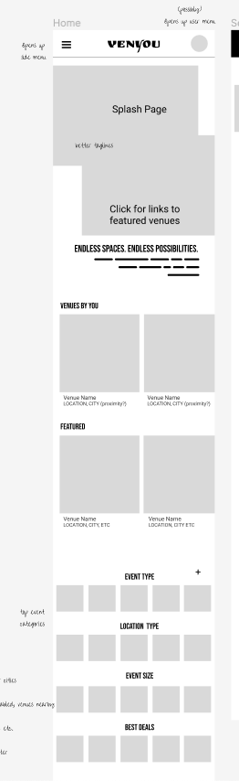
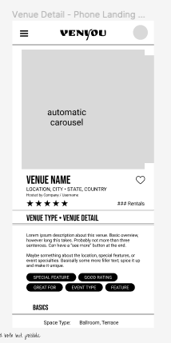
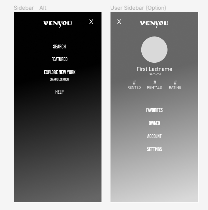
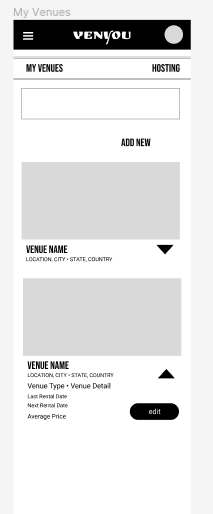
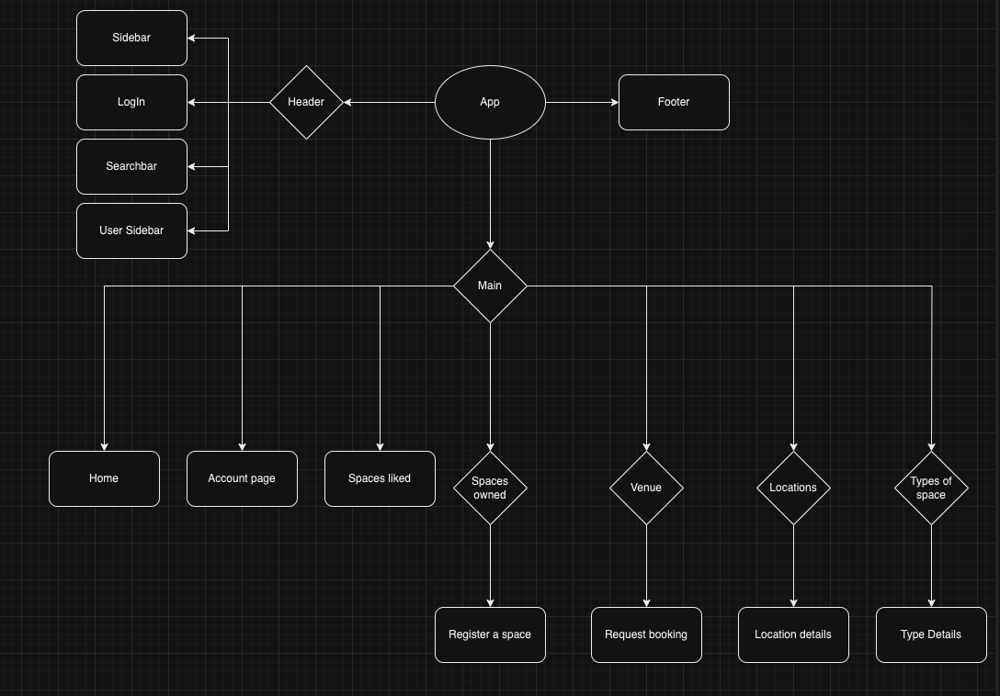
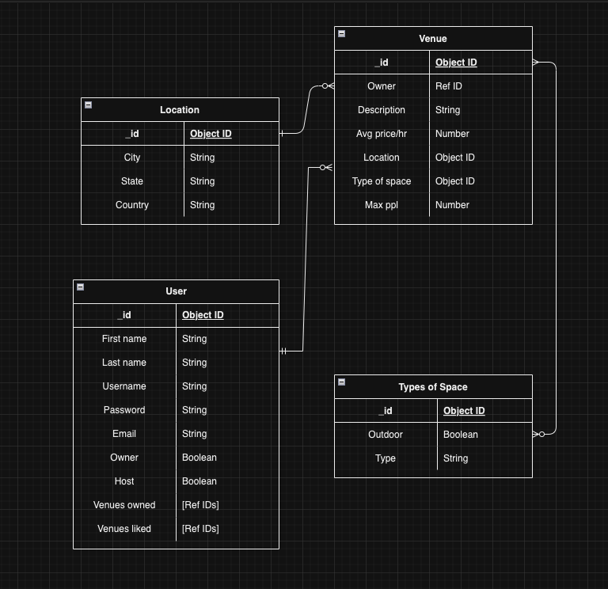

# eventnet

Looking for a cool art gallery to host your birthday party? Need a unique venue to impress clients at a holiday party?

## Frontend

#### Event Hosters

Event hosters will be able to find venues to impress their guests, no matter what kind or size of party they are throwing. They will be able to find venues in their locations, as well as filter by the type of venue they are looking for. Event hosters can communicate directly with venue owners in order to book venues and rate the venues afterwards. Venue pages will show other similar venues for ease of exploration.

#### Venue Owners

Venue owners will be able to easily list and edit their venues on the app. They can also take down any venues they no longer wish to rent out.

#### Design

Our app is a mobile-first design, emphasising pictures of venues to give event hosters a proper feel of venues.

#### Components

Our app is made up of three main components: the header, the footer and the main body of the app.

## Backend

#### ERD

Our database contains three models: location, venue and type of space. Venue will reference both location and type of space.

## Credits

- Rahat Ahmed ([Github](https://github.com/rahmed712) | [LinkedIn](https://www.linkedin.com/in/rahat-ahmed711/))
- Itzel Alwarafi ([Github](https://github.com/itzelalwarafi) | [LinkedIn](https://www.linkedin.com/in/itzelalwarafi/))
- Maddie Maslowsky ([Github](https://github.com/maddiemaz) | [LinkedIn](https://www.linkedin.com/in/madeline-maslowsky/))
- Claire Sheridan ([Github](https://github.com/cys2110) | [LinkedIn](www.linkedin.com/in/claire-y-sheridan))